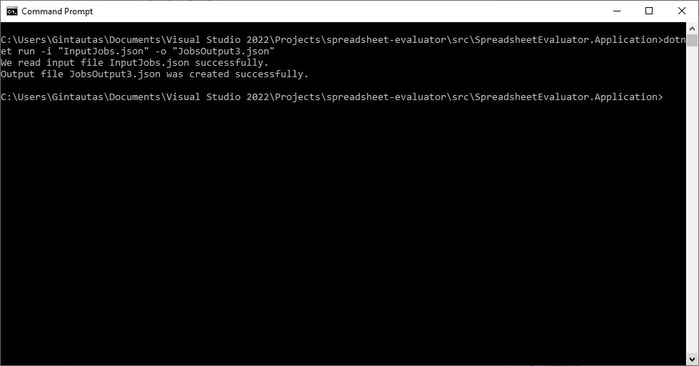
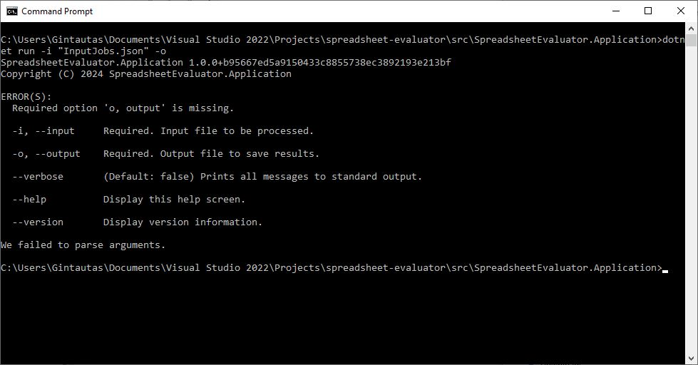

<div align="center">
  <h1>Spreadsheet evalutor</h1>
  <br />
  <br />
</div>

<details open="open">
<summary>Table of Contents</summary>

- [About](#about)
  - [How does it work](#how-does-it-work)
  - [Built With](#built-with)
- [Features](#features)
- [Example data](#example-data)
- [Usage](#usage)
- [Screenshots](#screenshots)
- [License](#license)

</details>

---

## About

<table>
<tr>
<td>

This project is a command-line interface (CLI) application developed using C# and .NET, designed to parse numerical spreadsheets, perform calculations, and write the results to a file. 
The spreadsheets are in a JSON format, and they can contain numbers, text and formulas. Spreadsheets can have invalid cells as well, but the whole input file should be a valid JSON.

Formulas can be like "A1 + A2", thus we are using recursion with numerous validation techniques to validate data and perform calculations.

It was initially developed to call an API, get spreadsheets from JSON, evaluate the spreadsheet, perform calculations and send results to another API endpoint.
Now, it uses CLI to ask for input and ouput files.

</td>
</tr>
</table>

### How does it work

This application is designed to process job data from an input file, compute necessary formulas, and save the results to an output file. Here's a step-by-step explanation of how it works:

1. **Handle CLI Arguments**: The application begins by handling command-line interface (CLI) arguments to determine the input and output file paths.

2. **Read Input File**: It reads job data from the specified input file using a helper function that deserializes the JSON content into a class object. If reading the file fails, an error message is displayed, and the application exits with an error code.

3. **Parse Jobs**: The raw job data is parsed into a list of job objects that the application can work with.

4. **Evaluate Formulas**: Evaluate formulas, such as "A1 + B2" to include the referenced values, like "5 + 6" using recursion.

5. **Compute Formulas**: The application processes the string formulas "5 + 6" to compute a single value: "11".

6. **Prepare Output Structure**: A post request structure is created to format the computed job data appropriately for the output file.

7. **Save Output File**: The computed and formatted job data is serialized back into JSON and saved to the specified output file. If saving the file fails, an error message is displayed, and the application exits with an error code.

8. **Completion**: Upon successful completion, a success message is displayed, and the application exits with a success code.

### Built With

- C#
- .NET 8
- Console
- Moq
- Fluent Assertions
- and other NUGET packages

## Features

<ul>
  <li>Features Domain-Driven design (DDD) architecture.</li>
  <li>The project has exit codes, console logs to inform the user about the program's state.</li>
  <li>Exception handling, displaying errors to the user.</li>
  <li>Using 3rd party libraries to ease our work: to help with json parsing, DI, unit testing and more.</li>
  <li>Application settings. You can set hard-coded values inside appsettings.json.</li>
  <li>We also have different class models (DTOs) for different HTTP GET and POST requests.</li>
  <li>For the testing part, we use xUnit, mocking, fluent assertions and more.</li>
  <li>We use AAA (Act-Arrange-Assert) structure for our tests.</li>
</ul>

### Example data

You can find both input and expected output files in the ```data``` folder.

**Input example:**
```json
{
  "jobs": [
    {
      "id": "job-3",
      "data": [
        [
          { "value": { "number": 6 } },
          { "value": { "number": 4 } },
          {
            "formula": {
              "sum": [
                { "reference": "A1" },
                { "reference": "B1" }
              ]
            }
          }
        ]
      ]
    },
    {
      "id": "job-4",
      "data": [
        [
          { "value": { "number": 6 } },
          { "value": { "number": 4 } },
          { "value": { "number": 7 } },
          {
            "formula": {
              "multiply": [
                { "reference": "A1" },
                { "reference": "B1" },
                { "reference": "C1" }
              ]
            }
          }
        ]
      ]
    },
  ]
}

```

**Output example:**
```json
{
  "email": "gintautas",
  "results": [
    {
      "id": "job-3",
      "data": [
        [
          {
            "value": {
              "number": 6.0
            }
          },
          {
            "value": {
              "number": 4.0
            }
          },
          {
            "value": {
              "number": 10.0
            }
          }
        ]
      ]
    },
    {
      "id": "job-4",
      "data": [
        [
          {
            "value": {
              "number": 6.0
            }
          },
          {
            "value": {
              "number": 4.0
            }
          },
          {
            "value": {
              "number": 7.0
            }
          },
          {
            "value": {
              "number": 168.0
            }
          }
        ]
      ]
    }
  ]
}
```

### Usage

#### Windows

1. Have Microsoft .NET 8 SDK installed.
2. Open CMD.
3. cd ```src\SpreadsheetEvaluator.Application```
4. Run the console app:
    ```shell
    dotnet run -i "path to the InputJobs.json" -o "path to the output file.json"
    ```

## Screenshots

<br>
Successfully running the console app with arguments.

<br>
Argument validation present when a required argument is not present.

[](https://youtu.be/7gRpbvYju30)<br>
The video demo

## License

This project is licensed under the **MIT license**. Feel free to edit and distribute this template as you like.

See [LICENSE](LICENSE) for more information.
